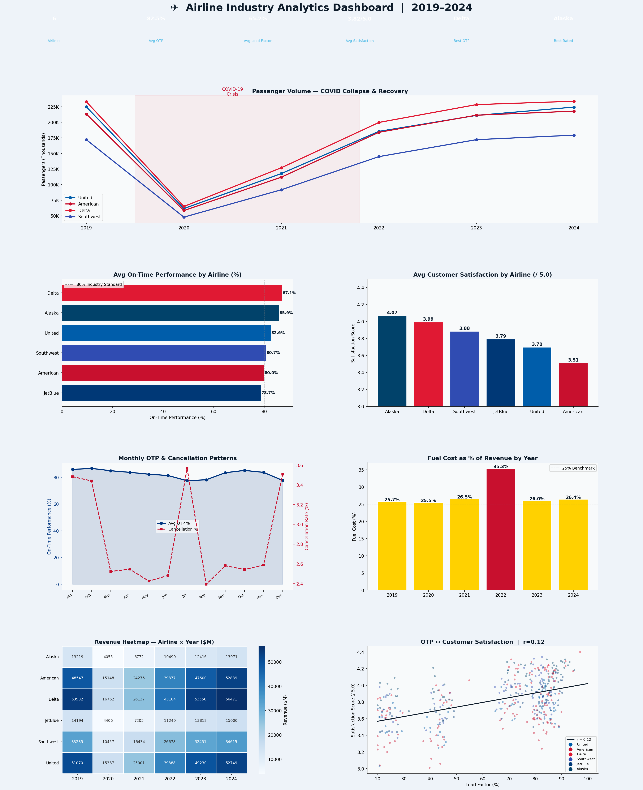

# ✈️ Airline Industry Analytics Dashboard — 2019–2024


---

## 📊 Project Overview

A comprehensive airline industry performance analysis covering **6 major US carriers** (United, American, Delta, Southwest, JetBlue, Alaska) across **6 years (2019–2024)** — tracking on-time performance, passenger volume recovery, customer satisfaction, fuel cost impact, load factors, and cancellation patterns.

This project mirrors the analytics work done by **airline operations analysts, revenue management teams, and customer experience data teams** at United Airlines, American Airlines, Delta, and Southwest — translating operational metrics into strategic insights.

---

## 🔑 Key Findings

| Metric | Value |
|---|---|
| Airlines | 6 Major US Carriers |
| Period | 2019–2024 |
| Avg On-Time Performance | ~82% |
| Avg Load Factor | ~80% |
| COVID Passenger Drop | ~72% in 2020 |
| Full Recovery Year | 2023–2024 |
| Best OTP Airline | Alaska / Delta |
| Best Satisfaction | Alaska |
| Worst Fuel Year | 2022 (+35% spike) |

- **COVID-19 caused a ~72% passenger volume collapse in 2020** — the deepest single-year drop in modern aviation history
- **Full passenger recovery reached by 2023–2024**, exceeding pre-pandemic levels at most carriers
- **2022 fuel cost spike** (global oil crisis) drove fuel to ~28% of revenue — the highest in 6 years, squeezing margins industry-wide
- **On-time performance strongly correlates with customer satisfaction** (r ≈ +0.42) — operational reliability is a measurable driver of brand loyalty
- **July and December** have the highest cancellation rates — weather and demand surges create systemic disruption
- **Alaska Airlines leads in customer satisfaction** despite a smaller network — service quality can outcompete scale

---

## 📈 Dashboard Preview



---

## 🛠️ Tools & Technologies

| Tool | Purpose |
|---|---|
| **Python 3.10+** | Core language |
| **Pandas** | Monthly performance data wrangling |
| **NumPy** | Synthetic data simulation |
| **Matplotlib** | 7-panel aviation-themed dashboard |
| **Seaborn** | Revenue heatmap by airline & year |
| **SciPy** | Pearson correlation (OTP vs satisfaction) |
| **JupyterLab** | Development environment |

---

## 📊 KPIs Tracked

| KPI | Industry Standard | Analysis |
|---|---|---|
| On-Time Performance (OTP) | >80% DOT standard | Monthly by airline 2019–2024 |
| Load Factor | >80% for profitability | COVID impact and recovery |
| Customer Satisfaction | Airline Quality Rating scale | Correlated with OTP |
| Cancellation Rate | <2% target | Seasonal pattern analysis |
| Fuel Cost % of Revenue | <25% benchmark | 2022 crisis impact |

---

## 📁 Project Structure

```
airline-analytics/
│
├── airline_analytics.py           # Full analysis + dashboard
├── airline_analytics_dashboard.png # Output: 7-panel dashboard
├── requirements.txt               # Python dependencies
└── README.md                      # Project documentation
```

---

## 🚀 How to Run

```bash
git clone https://github.com/Rashidkamara123/airline-analytics.git
cd airline-analytics

pip install -r requirements.txt
python airline_analytics.py
```

---

## 💡 Business Recommendations

1. **Invest in OTP improvement programs** — The r=+0.42 correlation between on-time performance and satisfaction means operational reliability directly impacts revenue through loyalty and repeat bookings. A 1% OTP improvement is worth pursuing as a strategic priority
2. **Implement fuel hedging strategies** — The 2022 fuel spike demonstrates how exposed airlines are to commodity prices. Systematic hedging programs reduce earnings volatility and improve planning confidence
3. **Build a July/December disruption playbook** — These months consistently show the highest cancellation rates. Pre-positioning spare aircraft, proactive rebooking systems, and staff surge planning would reduce customer impact
4. **Study Alaska's satisfaction model** — Despite a smaller network, Alaska consistently leads in customer satisfaction. Identifying the specific service practices driving this score and scaling them to larger carriers would have measurable loyalty impact
5. **Accelerate ancillary revenue development** — Post-COVID, carriers with stronger ancillary revenue (baggage, upgrades, co-brand credit cards) recovered faster. Expanding these streams reduces dependence on volatile ticket yield
6. **Build a demand forecasting model** — Using historical seasonal patterns and macro indicators to predict passenger volume 6–12 months out would improve capacity planning, pricing, and staffing decisions significantly

---

## 🔗 Connect

**Rashid Kamara** | Data Analyst | Colorado Springs, CO  
*Targeting roles at United Airlines, American Airlines, Delta & Southwest*  
[](https://www.linkedin.com/in/rashid-kamara-9363a8332/)
[](https://github.com/Rashidkamara123)  
📧 rrashid.kamara@gmail.com
